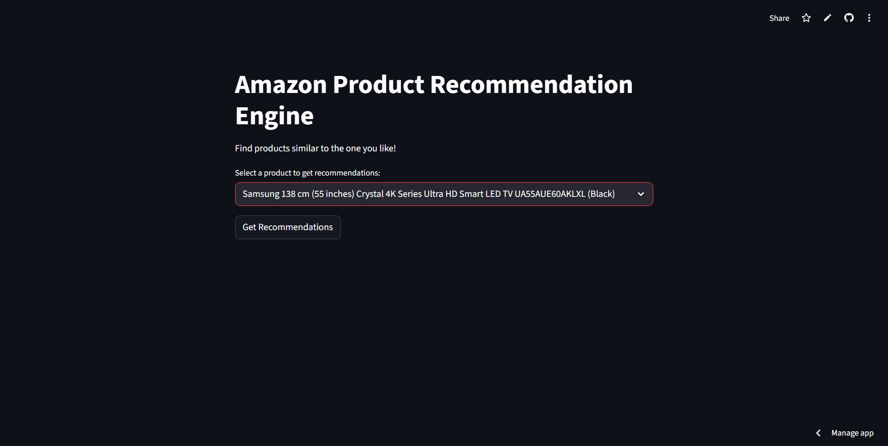

# Amazon Product & Customer Insights Engine

This is an end-to-end data science project that transforms a raw dataset of Amazon product reviews into a live, interactive **Content-Based Recommendation System**.

The final product is a **Streamlit web application** where a user can select any product from the dataset and instantly receive the **top 5 most similar products**, helping them discover new items and improve their shopping experience.

**Live Web:** [https://nitin-amazon-customer-insights-engine.streamlit.app/](https://nitin-amazon-customer-insights-engine.streamlit.app/)

---

##  Business Problem

In a vast e-commerce marketplace like Amazon, product discovery is a major challenge. A customer may find one product they like, but struggle to find similar items. This friction can lead to abandoned carts and lost sales.

This project solves that challenge by building a **"Similar Items" engine**, going beyond simple analytics into a functional, business-ready tool.

---

##  Solution Overview

The solution is a **Content-Based Recommendation System**, deployed as a Streamlit web app.

Instead of relying on ratings (often sparse), the model analyzes the **content of products themselves**. Each product receives a unique **"Product DNA"**, created using:

* Product Name
* Parent Category
* Product Description

This DNA allows the model to find highly similar products using text similarity.

---

##  App Demo




---

##  Technical Stack & Methodology

This project follows a structured, modular, production-ready workflow.

### 1. **Data Processing & Cleaning** (`src/data_processing.py`)

* Raw dataset: `amazon.csv` containing 1,462 reviews (not unique products).
* Key Insight: A recommender must operate on **products**, not reviews.
* Action: `drop_duplicates(subset=['product_id'])` → **1,348 unique products**.

### 2. **Feature Engineering: Product DNA**

* Cleaned messy category field (e.g., `Electronics|Accessories|...`) into a parent category.
* Created `product_dna` by combining:

  * product_name
  * parent_category
  * about_product

### 3. **The Recommendation Engine** (TF-IDF + Cosine Similarity)

* TF-IDF vectorization → (1348, 10110) sparse matrix.
* Cosine Similarity → (1348, 1348) matrix where each value is similarity between two products.

### 4. **Model Serialization & Scripting**

`run_training.py` generates three artifacts in `models/`:

* `products_df.pkl`
* `cosine_sim.pkl`
* `indices.pkl`

### 5. **Deployment** (Streamlit + Git LFS)

* Streamlit app loads artifacts efficiently using `st.cache_resource`.
* Git LFS enables version control for large `.pkl` files.

---

## Project Structure

```
amazon-recommender-project/
├── .gitattributes
├── .gitignore
├── README.md
├── app.py
├── run_training.py
├── requirements.txt
│
├── data/
│   └── 00_raw/
│       └── amazon.csv
│
├── models/
│   ├── products_df.pkl
│   ├── cosine_sim.pkl
│   └── indices.pkl
│
├── notebooks/
│
└── src/
    ├── __init__.py
    ├── data_processing.py
    └── recommender.py
```

---

## How to Run Locally

### 1. Clone the Repository

```
git clone https://github.com/your-username/amazon-recommender-project.git
cd amazon-recommender-project
```

### 2. Install Git LFS

Download from: [https://git-lfs.github.com/](https://git-lfs.github.com/)

```
git lfs install
```

### 3. Pull Large Model Files

```
git lfs pull
```

### 4. Set Up Python Environment

Create a virtual environment:

```
python -m venv .venv
```

Activate:

* **Mac/Linux:** `source .venv/bin/activate`
* **Windows:** `.\.venv\Scripts\activate`

### 5. Install Dependencies

```
pip install -r requirements.txt
```

### 6. Run the Streamlit App

```
streamlit run app.py
```

Your browser will open automatically.

---

## Future Improvements

* **Sentiment Analysis Integration** using VADER.
* **Hybrid Recommender System** combining content-based + collaborative filtering.
* **UI Enhancements**: Add product images, price, star ratings.
* **Search Functionality**: Replace dropdown with full-text search.

---

If you found this project useful, feel free to ⭐ star the repository or contribute!
